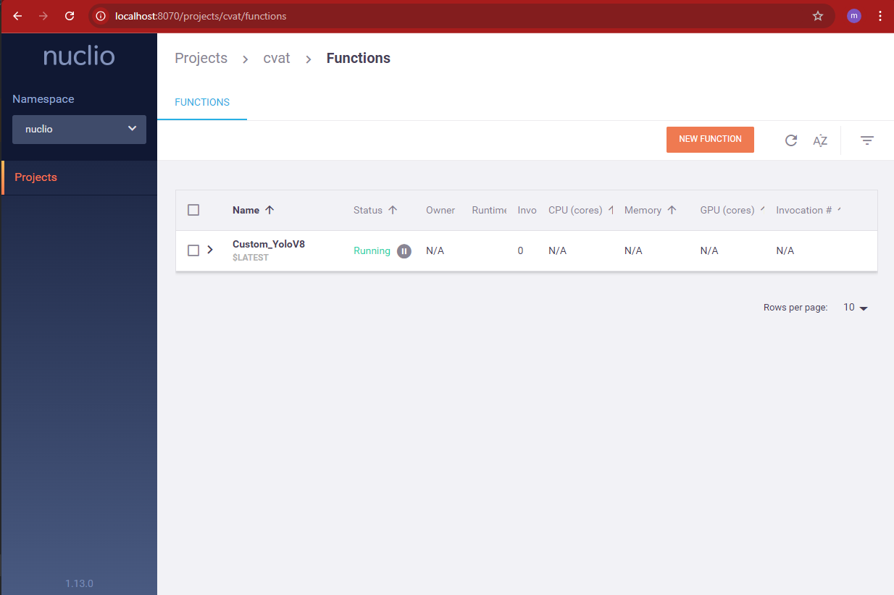
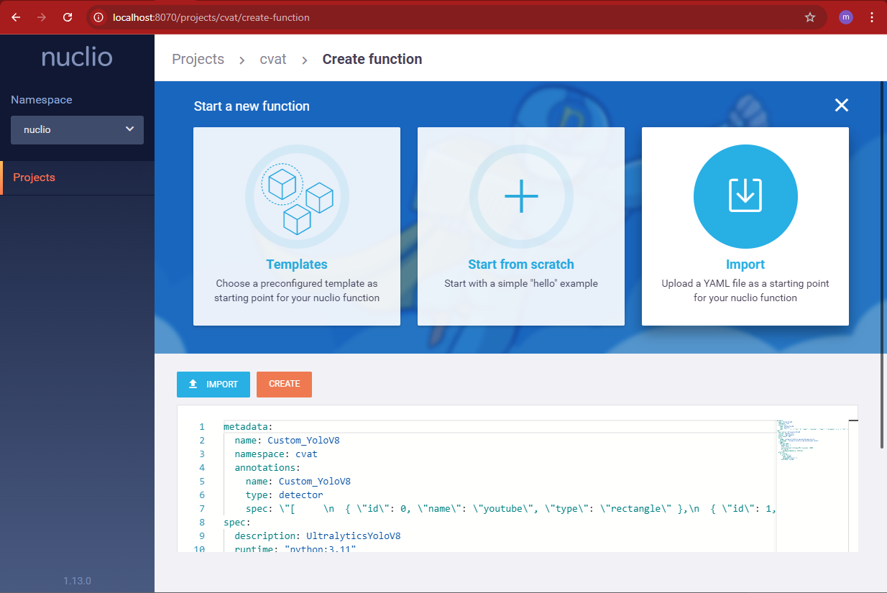
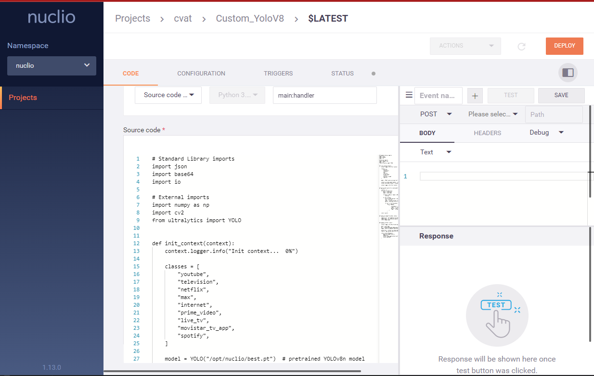
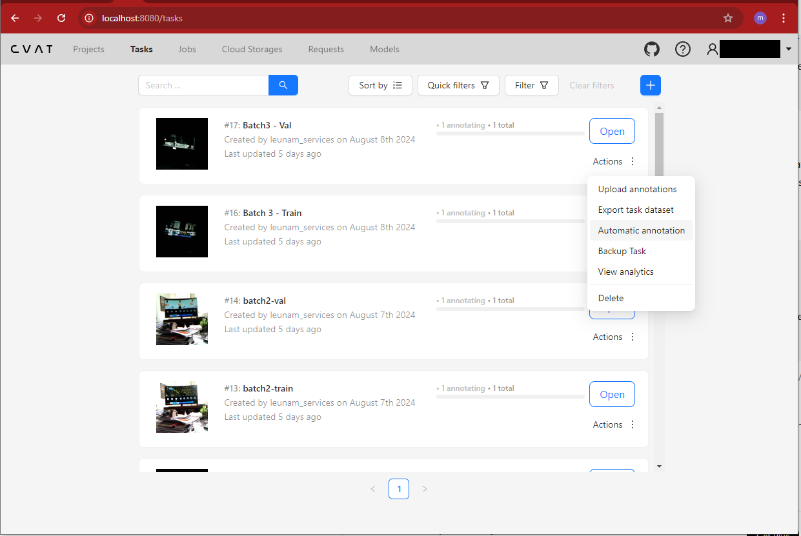

## Automatic annotation using CVAT

CVAT allows you to use your own model for automatic image annotation. After training a YOLOv8 nano model for an experiment, I've used it to assist me with additional annotations.

CVAT uses Nuclio to create a serverless service that runs the prediction code of your choice. To run it, you need to spawn some additional services using Docker Compose:

    docker compose -f docker-compose.yml -f docker-compose.dev.yml -f components/serverless/docker-compose.serverless.yml up -d --build

I faced a line endings issue with some Git files used by the CVAT and Nuclio services. I resolved this by configuring Git to preserve LF line endings for downloaded files. I then deleted my existing local CVAT repository and cloned it again:

    git config --global core.autocrlf input
    git clone git@github.com:cvat-ai/cvat.git
    git config --global core.autocrlf true  # restore the original conf 

This build requires more time and memory. On Windows, I allocated 6 GB of RAM to WSL2 to ensure Docker could run smoothly. The allocated memory can be adjusted this by modifying the `.wslconfig` file located in the user folder:

    [wsl2]
    memory=6GB

Finally, Nuclio was up, its UI could be accessed through `localhost:8070`:



## Deploying a Nuclio function for automatic annotation

The official CVAT tutorial suggests to use the Nuclio command line `nuctl` to deploy a new function. I was having trouble using `nuctl` on Windows, but I found that I didn't need it because I can accomplish the same using the UI.

This is what I did for deploying and re-deploying a Nuclio function:

- Create a Docker image with all the dependencies needed to run the code (surprisingly, I don't need to include the inference code at this step):

    ```
    FROM ultralytics/ultralytics:8.2.74-cpu
    ENV DEBIAN_FRONTEND=noninteractive
    WORKDIR /opt/nuclio
    COPY runs/detect/train18/weights/best.pt best.pt
    ```
    
    Build the image:
    
    ```
    docker build -f serverless/Dockerfile -t custom_ultralytics_cpu_yolov8_nano .
    ```

- Reference this Docker image on a `config.yml` file used by Nuclio:
    ```
    metadata:
    name: YoloV8n_person
    namespace: cvat
    annotations:
        name: YoloV8_nano_person
        type: detector
        spec: |
        [     
            { "id": 0, "name": "person", "type": "rectangle" },
        ]

    spec:
    description: UltralyticsYoloV8
    runtime: 'python:3.11'
    handler: main:handler
    eventTimeout: 30s

    build:
        image: custom_ultralytics_cpu_yolov8_nano_nuclio
        baseImage: custom_ultralytics_cpu_yolov8_nano:latest

    triggers:
        myHttpTrigger:
        maxWorkers: 2
        kind: 'http'
        workerAvailabilityTimeoutMilliseconds: 10000
        attributes:
            maxRequestBodySize: 33554432 # 32MB

    platform:
        attributes:
        restartPolicy:
            name: always
            maximumRetryCount: 3
        mountMode: volume
    ```

- Create a new Nuclio function in the UI and select the "Import" option. Click "IMPORT" and select the `config.yml` YAML file. Then click "CREATE":

    

- Paste the Python code that does inference in the Nuclio UI and click "deploy":
    
    


Nuclio uses the provided Docker image as a base image when creating the image that's finally used. It does this transparently and adds the inference code that was provided through the UI.


Finally, from the CVAT UI one can do auto annotation using the model serviced by Nuclio:





In the above image, the tags on the left column are the available classes in the model (defined in the YAML file), while the tags on the right column are the classes defined in the annotation task.

## Troubleshooting
If an error appears after starting the automatic annotation, look for errors in the Docker container logs.

Get the container name of the new Nuclio function:
```
docker container list
```

Show the container logs:
```
docker container logs -n 200 CONTAINER_NAME
```

Sometimes, the Nuclio function stops responding due to memory issues. I had allocated 6GB of RAM to WSL2, and if too many Nuclio functions were deployed simultaneously, the container would run out of memory and remain in that state even after a restart. In such cases, re-creating the Nuclio function resolves the issue.