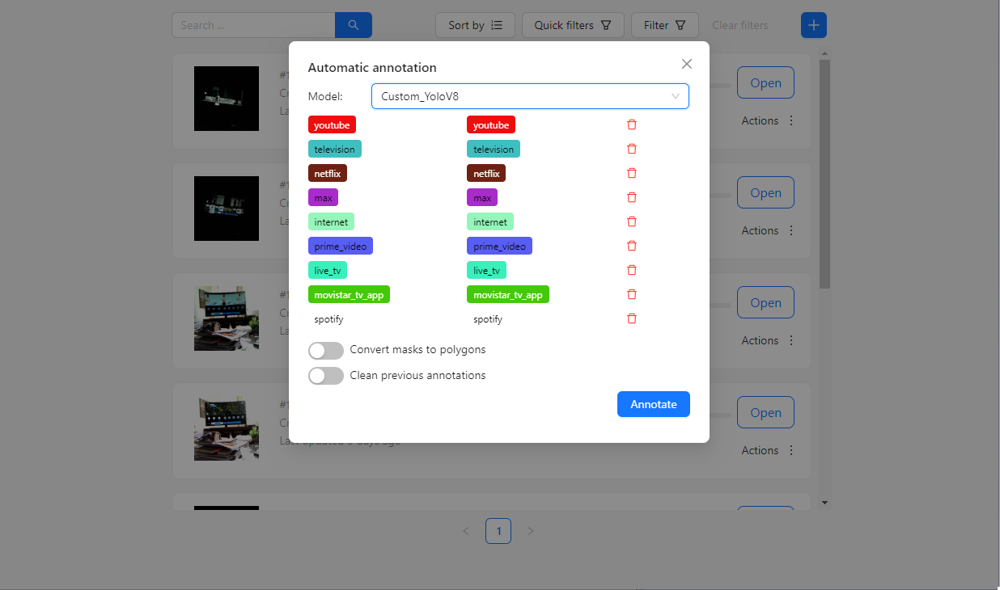

## Automatic annotation using CVAT

CVAT allows you to use your own model for automatic image annotation. After training a YOLOv8 nano model for an experiment, I've used it to assist me with additional annotations.

CVAT uses Nuclio to create a serverless service that runs the prediction code of your choice. To run it, you need to spawn some additional services using Docker Compose:

    docker compose -f docker-compose.yml -f docker-compose.dev.yml -f components/serverless/docker-compose.serverless.yml up -d --build

I faced a line endings issue with some Git files used by the CVAT and Nuclio services. I resolved this by configuring Git to preserve LF line endings for downloaded files. I then deleted my existing local CVAT repository and cloned it again:

    git config --global core.autocrlf input
    git clone git@github.com:cvat-ai/cvat.git
    git config --global core.autocrlf true  # restore the original conf 

This build requires more time and memory. On Windows, I allocated 6 GB of RAM to WSL2 to ensure Docker could run smoothly. The allocated memory can be adjusted this by modifying the `.wslconfig` file located in the user folder:

    [wsl2]
    memory=6GB

Finally, Nuclio was up, its UI could be accessed through `localhost:8070`:

## Deploying a Nuclio function for automatic annotation

The official CVAT tutorial suggests to use the Nuclio command line `nuctl` to deploy a new function. I was having trouble using `nuctl` on Windows, but I found that I didn't need it because I can accomplish the same using the UI.

This is what I needed to do for deploying and re-deploying a Nuclio function:

- Create a Docker image with all the dependencies needed to run the code (surprisingly, I don't need to include the inference code at this step).
- Reference this Docker image on a `config.yml` file that Nuclio uses.
- Create a new Nuclio service using the UI, passing the same `config.yml` YAML file mentioned above.

- Paste the Python code that does inference in the Nuclio UI and click "deploy":
    

Nuclio uses the provided Docker image as a base image when creating the image that's finally used. It does this transparently and adds the inference code that was provided through the UI.

To create the base image:

    docker build -f serverless/Dockerfile -t custom_ultralytics_cpu_yolov8_nano .

Finally, from the CVAT UI one can do auto annotation using the model serviced by Nuclio:

