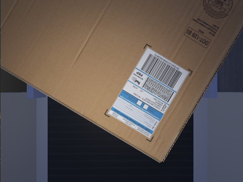
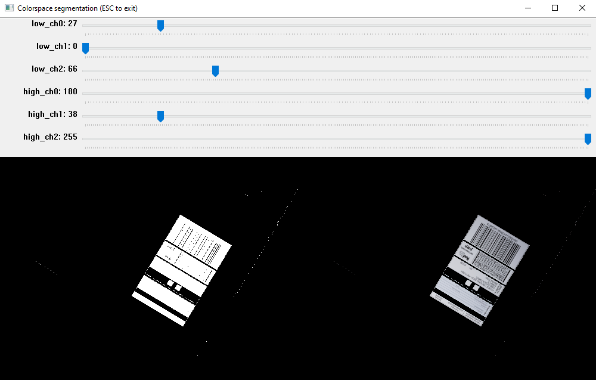

A document scanner application that converts images of rectangular documents into a top-down view, tested within a simulated environment using the Webots Robot Simulator and OpenCV for image processing. The simulation setup includes a conveyor belt, cardboard box models, a downward-facing camera, and light sources, highlighting key variables such as HSV threshold values, lighting conditions, box sizes, document sizes and 3D model textures, which influence the accuracy and reliability of the document scanner.

- *Get the code: [Document Scanner Simulation Github project](https://github.com/ManuelZ/document_scanner_simulation)*

## Components

The simulation is composed of five important components:

#### 1. A running conveyor belt
The conveyor belt is model provided by Webots to automate the movement of objects across an environment.

#### 2. Cardboard box models
Multiple instances of two cardboard box models running on top of the conveyor belt. The boxes have a document on one of their sides and it's assumed that this face is always pointing up. These reference to the source of these models can be found in the `README.md` files in the folders `protos/textures/cardboard-*/`.

#### 3. Camera
A camera placed on a structure, pointing downwards, towards the conveyor belt.

#### 4. Light sources
- A global light source, to illuminate the environment.
- A light source next to the camera, to illuminate the moving carboard boxes.

#### 5. Document scanner
A document scanner application for processing camera images. It's built with OpenCV, using the following classical Computer Vision techniques:

- Color segmentation in the HSV color space
- Contour detection
- Perspective transform 

The parameters with the most influence on the results are the HSV color threshold values used to segment the documents found in boxes like this one:

Using a simple OpenCV UI, it's possible to find good parameters for segmenting pieces of white paper. In the following image, the gray top part displays the selected lower and upper threshold parameters for HSV thresholding. The bottom part of the image shows the binary image created from the HSV thresholding on the left side and the segmented image on the right side.

## Demo

This demonstration shows how the simulation works. There are two displays: the top left display shows the raw footage from the camera, and the bottom left display shows the rectified document.

<video width="1920" height="1080" controls>
 <source src="https://github.com/ManuelZ/document_scanner_simulation/assets/115771/081c2016-b77b-4e0f-889d-1e3c95975116" type="video/webm">
</video>

The found document may be vertically flipped because no capability has been introduced to understand the content of the paper. It is only oriented so that the long side is positioned vertically.

## Observations

Testing this app in a simulation revealed that the following variables can influence its efficacy:

- The HSV threshold values
Finding a good set of HSV threshold values is only possible if all the documents have predominantly the same color, such as white.

- Intensity and direction of light sources
Thresholding can be affected by the direction and intensity of the light sources illuminating the scene.

- Size of the box model
To avoid false positives, some rules are used to filter out erroneous detections, such as filtering by area. If the boxes are too short and the camera is placed too high, the detected documents will have a small size in the photo, which could lead to them being mistakenly filtered out.

- Size of the document
If there are multiple documents of different sizes, this must be accounted for (along with the vertical distance from the camera to the document) to identify the smallest documents available.

- Model texture of the box:
There are features in the labeled boxes that could introduce some complexity in the detection of the documents, for example:
    - Lines due to the inherent texture of corrugated cardboard
    - Wrinkles in plain cardboard
    - Reflections due to the material of the box (some include a "metalness" texture to mimic plastic)

- Orientation of the documents as viewed from the camera
Boxes can appear rotated in different orientations, although for simplicity it's assumed that all labels appear in the top plane of the boxes, this plane can still appear arbitrarily rotated, making it harder to identify the correct orientation of the final warped document.

- Other figures or symbols present in the box
The contour detection step relies on finding quadrilateral blobs. If there are squared figures or symbols present in the boxes, these could be mistakenly identified as documents.

- Distance between boxes
The detection process expects to find a single document per image. If two or more boxes appear in the image, this could prevent the correct identification of the document corresponding to a box.

- Position of the camera
The position of the camera has an influence on what the camera perceives. A correct positioning could prevent surrounding objects or shadows from interfering with the detection.

- Camera parameters
The field of view of the camera significantly affects the image. Multiple fields of view and resolutions of commercial cameras can be tested to find the best results by adjusting these parameters before running the simulation. Some of these camera parameters include:
    - Field of view
    - Image resolution
    - Lens distortion
    - Lens flare 
    - Bloom

## Conclusion

This document scanner application demonstrated the ability to transform images of rectangular documents into a top-down view within a simulated environment using Webots. The simulation setup included a conveyor belt, cardboard box models, a downward-facing camera, and light sources, all of which contributed to test the accuracy and reliability of the document scanner. The scanner utilized OpenCV for image processing, employing techniques such as color segmentation in the HSV color space, contour detection, and perspective transform.

Several variables were found to influence the scanner's efficacy, including HSV threshold values, light intensity and direction, box and document sizes, model textures, document orientation, presence of other figures, distance between boxes, camera position, and camera parameters. In real-world applications, it's essential to identify which variables you can control and adjust them to compensate for the variables that are beyond your control. By fine-tuning the controllable factors, such as the camera position, HSV threshold values, local light intensity and direction, one can mitigate the impact of uncontrollable elements, like global lighting conditions and the presence of other environment objects.
